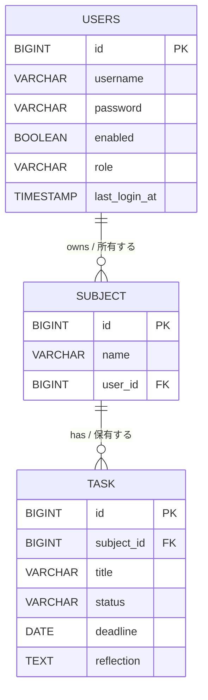

# 学習進捗トラッカー（tracker）

Spring Boot + Thymeleaf + JDBC(H2) + Spring Security で作った、**科目**と**タスク**の学習進捗を管理するシンプルなWebアプリです。
ユーザー認証・マルチユーザーに対応しており、自分のデータのみ管理できます。

---

## 目次

1. [機能](#機能)
2. [技術スタック](#技術スタック)
3. [プロジェクト構成](#プロジェクト構成)
4. [前提条件](#前提条件)
5. [起動方法](#起動方法)
6. [画面・エンドポイント](#画面エンドポイント)
7. [データベース](#データベース)
8. [セキュリティ設計](#セキュリティ設計)
9. [ドキュメント](#ドキュメント)
10. [テスト](#テスト)

---

## 機能

- 科目一覧表示（進捗％・完了/総タスク数）
- 科目の追加 / 削除
- 科目詳細（タスク一覧）
- タスクの追加 / ステータス変更 / 削除
- トップページでの期限切れのタスク警告表示
- タスクのステータス管理(未着手・進行中・完了) および絞り込み
- タスク一覧の並び替え(登録順・期限順)
- タスク振り返り(コメント欄)の記録
- ユーザー認証(ログイン・ログアウト)
- ユーザー登録 (新規アカウント作成)
- 管理者画面 (ADMIN ロール専用)
- 全ユーザーの学習状況一覧（完了数/未完了数・最終ログイン日時）

---

## 技術スタック

| 技術 | バージョン / 説明 |
|---|---|
| Java | **25**（`pom.xml` の `java.version`） |
| Spring Boot | 3.5.9 |
| Spring Web | HTTPリクエストを処理するWebフレームワーク |
| Thymeleaf | HTMLテンプレートエンジン（サーバー側で画面を生成） |
| Spring JDBC | `JdbcTemplate` でSQLを実行するデータアクセス |
| H2 Database | インメモリ（メモリ上で動く軽量DB。再起動でデータリセット） |
| Maven | ビルド・依存管理ツール（Wrapper同梱: `./mvnw`） |
| Spring Security | ユーザー認証・認可 |

---

## プロジェクト構成

> Spring Bootのプロジェクトは「役割ごとにフォルダを分ける」のが基本です。  
> 以下のように、**コントローラー（画面の制御）→ サービス（業務ロジック）→ リポジトリ（DBアクセス）** という3層構造になっています。

```
java-tracker/
├── pom.xml                          ... Maven設定（依存ライブラリやJavaバージョンの指定）
├── mvnw / mvnw.cmd                  ... Maven Wrapper（Mavenをインストールしなくても使える）
├── README.md                        ... このファイル
│
├── docs/                            ... ドキュメント
│   ├── er-diagram.md                ... ER図（データベース設計図）
│   └── javadoc/                     ... Javadoc API リファレンス（HTML）
│       └── index.html               ... Javadocトップページ
│
└── src/
    ├── main/
    │   ├── java/com/example/tracker/
    │   │   ├── TrackerApplication.java              ... ★ アプリのエントリーポイント（起動クラス）
    │   │   │
    │   │   ├── config/                              ... ⚙️ 設定層
    │   │   │   └── SecurityConfig.java              ...   Spring Security設定（認証・認可）
    │   │   │ 
    │   │   ├── exception/                           ... ⚠️ カスタム例外
    │   │   │   ├── AccessForbiddenException.java    ...   アクセス拒否例外
    │   │   │   └── ResourceNotFoundException.java   ...   リソース未発見例外
    │   │   │ 
    │   │   ├── model/                               ... 📦 モデル層（データの「形」を定義）
    │   │   │   ├── User.java                        ...   ユーザーを表すクラス
    │   │   │   ├── Subject.java                     ...   科目を表すクラス
    │   │   │   ├── Task.java                        ...   タスクを表すクラス
    │   │   │   ├── SubjectSummary.java              ...   科目＋進捗統計をまとめたクラス
    |   |   |   ├── UserProgress.java                ...   ユーザーごとの学習進捗(完了数/未完了数・最終ログイン日時)をまとめたクラス
    |   |   |   ├── TaskStats.java                   ...   タスクの統計情報をまとめたクラス
    │   │   │   └── TaskStatus.java                  ...   タスクステータスEnum（NOT_STARTED/IN_PROGRESS/DONE）
    │   │   │
    │   │   ├── repository/                          ... 🗄️ リポジトリ層（DBとのやり取り）
    │   │   │   ├── UserRepository.java              ...   ユーザーリポジトリ（インターフェース）
    │   │   │   ├── UserRepositoryImpl.java          ...   ユーザーリポジトリ（実装）
    │   │   │   ├── SubjectRepository.java           ...   科目リポジトリ（インターフェース）
    │   │   │   ├── SubjectRepositoryImpl.java       ...   科目リポジトリ（実装）
    │   │   │   ├── TaskRepository.java              ...   タスクリポジトリ（インターフェース）
    │   │   │   └── TaskRepositoryImpl.java          ...   タスクリポジトリ（実装）
    │   │   │
    │   │   ├── service/                             ... 🔧 サービス層（ビジネスロジック）                 
    │   │   │   ├── TrackerService.java              ...   所有者チェック・業務ロジック
    │   │   │   └── CustomUserDetailsService.java    ...   Spring Security用ユーザー取得
    │   │   │
    │   │   └── controller/                          ... 🎮 コントローラー層（画面からのリクエストを処理）
    |   |       ├── AdminController.java             ...   管理者画面の制御
    │   │       ├── AuthController.java              ...   ログイン・ユーザー登録画面の制御
    │   │       └── TrackerController.java           ...   科目・タスク操作のエンドポイント
    │   │
    │   └── resources/
    │       ├── application.properties               ... アプリ設定（DB接続先、ポート番号など）
    │       ├── schema.sql                           ... テーブル定義SQL（起動時に自動実行）
    │       ├── data.sql                             ... サンプルデータ投入SQL（起動時に自動実行）
    │       └── templates/                           ... 🖥️ HTMLテンプレート（Thymeleaf）
    |           ├── admin/
    |           |   └── index.html                   ...   管理者画面
    │           ├── index.html                       ...   科目一覧ページ
    │           ├── subject_details.html             ...   科目詳細（タスク一覧）ページ
    │           ├── login.html                       ...   ログイン画面
    │           └── register.html                    ...   ユーザー登録画面
    │
    └── test/                                              ... 💯 テストコード
        └── java/com/example/tracker/
            ├── EducationManagementApplicationTest.java    ...   アプリ起動確認テスト
            ├── SecurityTest.java                          ...   未認証アクセスのテスト
            ├── TrackerApplicationTests.java               ...   Spring Boot 起動テスト
            ├── controller/
            │   ├── AdminControllerTest.java               ...   管理者コントローラーのテスト 
            |   ├── AuthControllerTest.java                ...   認証・ユーザー登録テスト
            |   └── TrackerControllerTest.java             ...   コントローラーのテスト
            ├── model/
            │   ├── SubjectTest.java                       ...   科目モデルのテスト
            │   ├── SubjectSummaryTest.java                ...   科目進捗統計モデルのテスト
            |   ├── TaskStatsTest.java                     ...   タスク統計モデルのテスト
            │   └── TaskTest.java                          ...   タスクモデルのテスト
            └── repository/
                ├── SubjectRepositoryImplTest.java         ...   科目リポジトリのテスト
                ├── TaskRepositoryImplTest.java            ...   タスクリポジトリのテスト
                └── UserRepositoryImplTest.java            ...   ユーザリポジトリのテスト
```

---

## 3層アーキテクチャの流れ

```
[ブラウザ] ⇄ [Controller] ⇄ [Service] ⇄ [Repository] ⇄ [H2 Database]
                  ↕                         　
              [Thymeleaf] (HTML生成)                
※ 所有者チェック: Controller が userId を取得し、Service を仲介してRepository の WHERE user_id = ? で自分のデータだけに絞り込む
※ Model（Subject, Task, User など）は全層で共通利用されるデータ構造

```

1. **ブラウザ** からHTTPリクエスト（例: `GET /`）が送られる
2. **Controller** がリクエストを受け取り、Serviceに処理を依頼する
3. **Service** が業務ロジックを処理し、Repositoryにデータを要求する
4. **Repository** がJdbcTemplateでSQLを実行し、Modelオブジェクトとしてデータを返す
5. **Controller** がModelをThymeleafテンプレートに渡し、HTMLを生成して返す

---

## マルチユーザー対応

このアプリは**マルチユーザー対応**です。ログイン中のユーザーは自分のデータのみ操作できます。

#### 所有者チェックの仕組み（2段階チェック）

| 段階 | 担当 | 内容 |
|---|---|---|
| ① 認証チェック | Spring Security | 未認証リクエストを `/login` にリダイレクト |
| ② 所有者チェック | Controller / Service /Repository | Controller が `user_id` を取得し、Repositoryの `WHERE user_id = ?` で絞り込み、Serviceが結果0なら例外をスロー |

---

## 前提条件

- **Java 25** 以上がインストールされていること
  - 確認コマンド: `java -version`
- Maven のインストールは不要（Wrapperが同梱されています）

---

## 起動方法

```bash
# Windows の場合
.\mvnw.cmd spring-boot:run

# Mac / Linux の場合
./mvnw spring-boot:run
```

起動後、ブラウザで以下にアクセスします:

- **アプリ**: [http://localhost:8080/](http://localhost:8080/)

> **補足**: H2はインメモリDBのため、アプリを停止するとデータはリセットされます。  
> 起動するたびに `data.sql` のサンプルデータが投入されます。

### 初期ユーザー(data.sql で自動投入)

起動時に `data.sql` で以下のサンプルユーザーが自動投入されます。

| ユーザー名 | パスワード | 所有データ |
|---|---|---|
| `user`  | `pass`  | Java科目、データベース科目 |
| `user2` | `pass2` | Spring Framework科目 |
| `admin` | `pass3` | なし （管理ユーザー）|

> パスワードは BCrypt でハッシュ化して保存されています。
> これらはローカル開発用のサンプルデータです。

## 画面・エンドポイント

### 科目一覧（トップページ）

| 操作 | HTTP | パス | パラメータ |
|---|---|---|---|
| 一覧表示・期限切れの警告表示 | `GET` | `/` | なし |
| 科目追加 | `POST` | `/subjects` | `name`（科目名） |
| 科目削除 | `POST` | `/subjects/{id}/delete` | なし |

### 科目詳細（タスク一覧）

| 操作 | HTTP | パス | パラメータ |
|---|---|---|---|
| 詳細表示 (絞り込み・ソート) | `GET` | `/subjects/{id}` | `statusFilter`, `sortOrder` |
| タスク追加 | `POST` | `/subjects/{subjectId}/tasks` | `title`(タスク名), `status`(ステータス), `deadline`(期日), `reflection`(振り返り欄)|
| 振り返りの保存 | `POST` | `/tasks/{taskId}/reflection` | `subjectId`, `reflection` |
| タスク削除 | `POST` | `/tasks/{taskId}/delete` | `subjectId` |
| ステータス更新 | `POST` | `/tasks/{taskId}/status` | `subjectId`, `status` |

### ユーザー認証

| 操作 | HTTP | パス | パラメータ |
|---|---|---|---|
| ログイン画面表示 | `GET` | `/login` | なし |
| ログイン処理 | `POST` | `/login` | `username`, `password` |
| ログアウト　| `POST` | `/logout` | なし |

### ユーザー登録
| 操作 | HTTP | パス | パラメータ |
|---|---|---|---|
| 登録画面表示 | `GET` | `/register` | なし |
| 登録処理 | `POST` | `/register` | `username`, `password` |

**入力バリデーション**
| 操作 | ルール | エラー時の挙動 |
|---|---|---|
| ユーザー名 | 必須・2文字以上 | エラーメッセージを表示して `/register` に戻る |
| パスワード | 必須・4文字以上 | 同上 |
| ユーザー名 (重複) | 既存と重複不可 | 「そのユーザー名はすでに使われています。」 |

### 管理者画面
| 操作 | HTTP | パス | パラメータ |
|---|---|---|---|
| ユーザー一覧表示＋学習状況一覧表示 | `GET` | `/admin` | なし |
| 権限変更 | `POST` | `/admin/users/{id}/role` | `role` ("ADMIN" または "GENERAL") |

---

## データベース

H2（インメモリ）を使用し、起動時に以下のファイルで自動初期化されます。

| ファイル | 役割 |
|---|---|
| `src/main/resources/schema.sql` | テーブル定義（`USERS`, `SUBJECT`, `TASK`）|
| `src/main/resources/data.sql` | サンプルデータの投入 |

### ER図

ユーザー (USERS) ・ 科目（SUBJECT）・ タスク（TASK）の関係は以下のとおりです。  
詳細は [`docs/er-diagram.md`](docs/er-diagram.md) を参照してください。



### H2 Console（DBの中身をブラウザから確認）

| 項目 | 値 |
|---|---|
| URL | [http://localhost:8080/h2-console](http://localhost:8080/h2-console) |
| JDBC URL | `jdbc:h2:mem:testdb` |
| User Name | `sa` |
| Password | （空欄のまま） |

> **H2 Console とは？**: アプリが使っているデータベースの中身を、ブラウザ上で直接SQLを打って確認できるツールです。

設定は `src/main/resources/application.properties` を参照してください。

---

## セキュリティ設計

### 認証必須パス

| パス | 認証 | 説明 |
|---|---|---|
| `/login` | 不要 | ログインページ |
| `/register` | 不要 | ユーザー登録 |
| `/css/**` | 不要 | 静的リソース |
| `/admin/**` | **ADMIN ロール必須**　| 一般ユーザーは 403 | 
| それ以外全て | **必須** | 未認証は `/login` にリダイレクト |

### ロール設計

| ロール | 説明 | アクセス可能ページ |
|---|---|---|
| `GENERAL` | 一般ユーザー | `/` 以下 (自分のデータのみ) |
| `ADMIN` | 管理者 | `/admin/**` (全ユーザー管理) |

ログイン成功後、`ADMIN` は `/admin` へ、 `GENERAL` は `/` へ自動リダイレクトされます。

### 多層セキュリティチェック

**基本2段階チェック (全リクエストに適用)**

**① Spring Security による認証チェック**
`SecurityConfig` で設定。未ログインユーザーは自動的に `/login` へリダイレクトされます。

**② Controller / Service / Repository 層での所有者チェック**
認証済みでも、他ユーザーのデータはアクセスできません。
- Controller: `Principal` からログインユーザーのIDを取得し、Serviceに渡す
- Repository: SQL に `WHERE user_id = ?` を付加し、自分の行だけを対象とする
- Service: Repository の実行結果を見て、0件なら他人のデータへのアクセスと判断し `AccessForbiddenException` をスロー

```
例: 科目削除の場合
  Controller → trackerService.deleteSubjectForCurrentUser(id, userId)
  Service    → subjectRepository.deleteByIdAndUserId(id, userId)
  Repository → DELETE FROM SUBJECT WHERE id = ? AND user_id = ?

```

アクセス違反時は `AccessForbiddenException`、
リソース未発見時は `ResourceNotFoundException` をスローし、トップページへリダイレクトします。

**補助的な安全装置**

**③ 自己ロックアウト防止**
`AdminController` で、ログイン中のユーザー自身の権限変更を禁止しています。
(管理者が自分の権限を誤って GENERAL に落とし、管理画面に入れなくなる事故を防ぐ)

### パスワード管理

- パスワードは **BCrypt** でハッシュ化して `USERS` テーブルに保存
- 平文パスワードは一切保存しない
- `enabled = false` のユーザーはログイン不可

---

## ドキュメント

| ドキュメント | 場所 | 説明 |
|---|---|---|
| ER図 | [`docs/er-diagram.md`](docs/er-diagram.md) | テーブル設計をMermaid記法で図示 |
| Javadoc | [`docs/javadoc/index.html`](docs/javadoc/index.html) | 全クラス・メソッドのAPIリファレンス（HTML） |

### Javadocの再生成

ソースコードを変更した場合、以下のコマンドでJavadocを更新できます:

```bash
# Windows
.\mvnw.cmd javadoc:javadoc

# Mac / Linux
./mvnw javadoc:javadoc
```

---

## テスト

```bash
# Windows
.\mvnw.cmd test

# Mac / Linux
./mvnw test
```

### テストの種類

| カテゴリ | クラス | 内容 |
|---|---|---|
| Security テスト | `SecurityTest` | 未認証アクセスのリダイレクト確認 |
| Controller テスト | `TrackerControllerTest` / `AdminControllerTest` / `AuthControllerTest`| 画面表示・所有者チェック動作確認・登録バリデーション動作確認・管理画面ロール制御の(403)確認 |
| Repository テスト | `SubjectRepositoryImplTest` / `TaskRepositoryImplTest` / `UserRepositoryImplTest` | DBアクセスのテスト(学習状況集計・タスク無しユーザーの保持・最終ログイン日時のnull許容/更新を含む) |
| Model テスト | `SubjectTest` / `TaskTest` / `SubjectSummaryTest` / `TaskStatsTest`| モデルクラスのテスト(getter/setter・進捗率計算・完了判定の確認) |

### `@WithMockUser`　について

Controller テストでは Spring Security Test の `@WithMockUser` を使い、
実際にログインせずに認証済みユーザーとしてリクエストをシミュレートします。

```java
// 例: "testuser" としてログイン済みの状態でリクエストを送る
@Test
@WithMockUser(username = "testuser")
void testGetSubjects() throws Exception {
    mockMvc.perform(get("/"))
           .andExpect(status().isOk());
}
```

> `@WithMockUser` なしで認証が必要なエンドポイントにアクセスすると、 `302` (ログインにリダイレクト)が返ります。

---