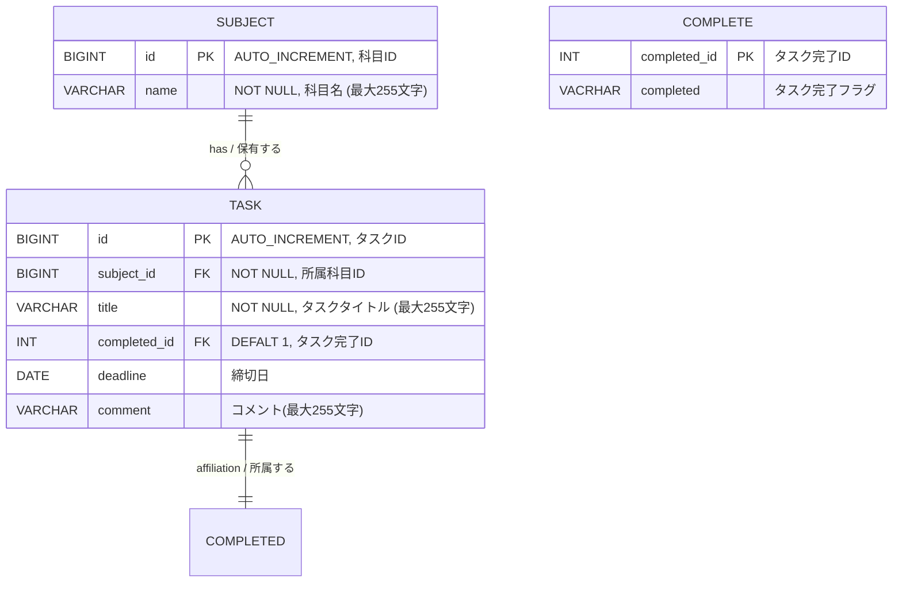

# ER Diagram / ER図

## Overview / 概要

English:
This document describes the Entity-Relationship diagram for the Learning Progress Tracker (java-tracker) application.
The database uses H2 (in-memory) and consists of two tables: `SUBJECT` and `TASK`.

Japanese (日本語):
本ドキュメントは、学習進捗トラッカー (java-tracker) アプリケーションのER図を記述します。
データベースはH2（インメモリ）を使用し、`SUBJECT` テーブルと `TASK` テーブルの2つで構成されます。

---

## ER Diagram (Mermaid) / ER図（Mermaid記法）

## Relationship Details / リレーション詳細

| Relation / 関連 | Type / 種別 | Description (EN) | 説明 (日本語) |
|---|---|---|---|
| SUBJECT → TASK | 1 : N (One-to-Many) | One subject can have zero or more tasks | 1つの科目は0個以上のタスクを持つ |
| TASK → SUBJECT | N : 1 (Many-to-One) | Each task belongs to exactly one subject | 各タスクは必ず1つの科目に属する |

## Constraints / 制約

| Table / テーブル | Column / カラム | Constraint (EN) | 制約 (日本語) |
|---|---|---|---|
| SUBJECT | `id` | Primary Key, Auto Increment | 主キー、自動採番 |
| SUBJECT | `name` | NOT NULL, VARCHAR(255) | NULL不可、最大255文字 |
| TASK | `id` | Primary Key, Auto Increment | 主キー、自動採番 |
| TASK | `subject_id` | Foreign Key → SUBJECT(id), NOT NULL, ON DELETE CASCADE | 外部キー → SUBJECT(id)、NULL不可、カスケード削除 |
| TASK | `title` | NOT NULL, VARCHAR(255) | NULL不可、最大255文字 |
| TASK | `completed_id` | Foreign Key → COMPLETE(co,mplete_id) INT DEFAULT 1 | デフォルト: 1 |
| TASK | `deadline` |  DATE | 
| TASK | `comment` | VARCHAR(255)  | 最大255文字 |

| COMPLETED | `completed_id` | Primary Key INT |　タスク完了ID |
| COMPLETED | `completed` | VARCHAR | 完了フラグ |

## Notes / 備考

English:
- When a `SUBJECT` is deleted, all associated `TASK` records are automatically deleted (`ON DELETE CASCADE`).
- The database is initialized at startup using `schema.sql` and `data.sql` located in `src/main/resources/`.

Japanese (日本語):
- `SUBJECT` を削除すると、紐づく `TASK` レコードもすべて自動削除されます（`ON DELETE CASCADE`）。
- データベースは起動時に `src/main/resources/` 配下の `schema.sql` と `data.sql` で初期化されます。
