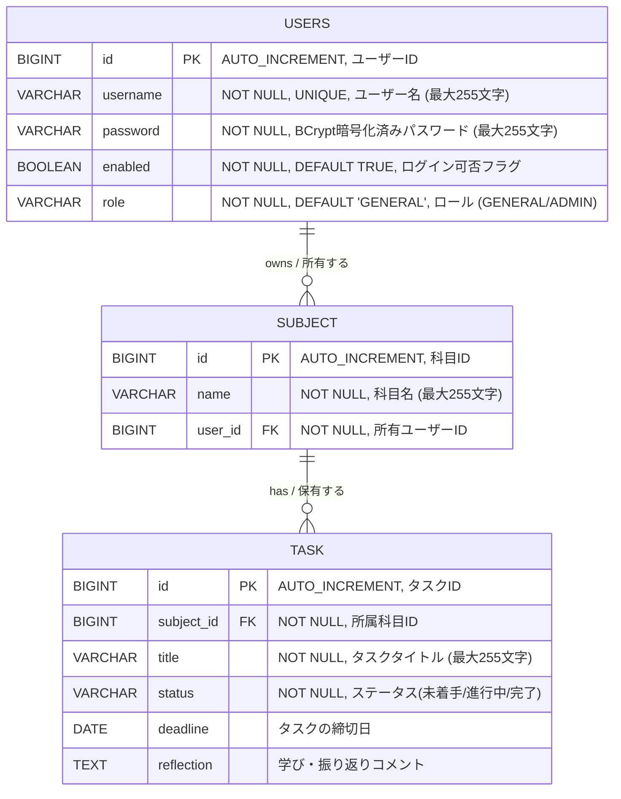

# ER Diagram / ER図

## Overview / 概要

English:
This document describes the Entity-Relationship diagram for the Learning Progress Tracker (java-tracker) application.
The database uses H2 (in-memory) and consists of three tables: `USERS`, `SUBJECT`, and `TASK`.

Japanese (日本語):
本ドキュメントは、学習進捗トラッカー (java-tracker) アプリケーションのER図を記述します。
データベースはH2（インメモリ）を使用し、`USERS` テーブル、`SUBJECT` テーブル、`TASK` テーブルの3つで構成されます。

---

## ER Diagram (Mermaid) / ER図（Mermaid記法）

## Relationship Details / リレーション詳細

| Relation / 関連 | Type / 種別 | Description (EN) | 説明 (日本語) |
|---|---|---|---|
| USERS → SUBJECT | 1 : N (One-to-Many) | One user can have zero or more subjects | 1人のユーザーは0個以上の科目を持つ |
| SUBJECT → USERS | N : 1 (Many-to-One) | Each subject belongs to exactly one user | 各科目は必ず1人のユーザーに属する |
| SUBJECT → TASK | 1 : N (One-to-Many) | One subject can have zero or more tasks | 1つの科目は0個以上のタスクを持つ |
| TASK → SUBJECT | N : 1 (Many-to-One) | Each task belongs to exactly one subject | 各タスクは必ず1つの科目に属する |

## Constraints / 制約

| Table / テーブル | Column / カラム | Constraint (EN) | 制約 (日本語) |
|---|---|---|---|
| USERS | `id` | Primary Key, Auto Increment | 主キー、自動採番 |
| USERS | `username` | NOT NULL, UNIQUE, VARCHAR(255) | NULL不可、一意、最大255文字 |
| USERS | `password` | NOT NULL, VARCHAR(255) | NULL不可、BCrypt暗号化済み |
| USERS | `enabled` | NOT NULL, BOOLEAN, DEFAULT TRUE | NULL不可、DEFAULT TRUE, ログイン可否フラグ |
| USERS | `role` | NOT NULL, VARCHAR(20), DEFAULT 'GENERAL' | NULL不可、 ロール (GENERAL / ADMIN) |
| SUBJECT | `id` | Primary Key, Auto Increment | 主キー、自動採番 |
| SUBJECT | `name` | NOT NULL, VARCHAR(255) | NULL不可、最大255文字 |
| SUBJECT | `user_id` | Foreign Key → USERS(id), NOT NULL, ON DELETE CASCADE | 外部キー → USERS(id)、NULL不可、カスケード削除 |
| TASK | `id` | Primary Key, Auto Increment | 主キー、自動採番 |
| TASK | `subject_id` | Foreign Key → SUBJECT(id), NOT NULL, ON DELETE CASCADE | 外部キー → SUBJECT(id)、NULL不可、カスケード削除 |
| TASK | `title` | NOT NULL, VARCHAR(255) | NULL不可、最大255文字 |
| TASK | `status` | NOT NULL, VARCHAR(20) | NULL不可、ステータス管理 |
| TASK | `deadline` | DATE | 期限日 |
| TASK | `reflection` | TEXT | 学び・振り返り(長文可) |

English:
- When a `USERS` record is deleted, all associated `SUBJECT` records are automatically deleted (`ON DELETE CASCADE`).
- When a `SUBJECT` is deleted, all associated `TASK` records are automatically deleted (`ON DELETE CASCADE`).
- Each `SUBJECT` belongs to one `USERS` record through `user_id`.
- The database is initialized at startup using `schema.sql` and `data.sql` located in `src/main/resources/`.
- Passwords are stored as BCrypt-encoded hashes. Plain text passwords are never stored.
- Only users with `enabled = true` can log in.

Japanese (日本語):
- `USERS` を削除すると、紐づく `SUBJECT` レコードもすべて自動削除されます (`ON DELETE CASCADE`) 。
- `SUBJECT` を削除すると、紐づく `TASK` レコードもすべて自動削除されます（`ON DELETE CASCADE`）。
- 各 `SUBJECT` は `user_id` によって1つの `USERS` レコードに属します。
- データベースは起動時に `src/main/resources/` 配下の `schema.sql` と `data.sql` で初期化されます。
- パスワードはBCryptでハッシュ化して保存されます。平文のパスワードは保存されません。
- `enabled = true` のユーザーのみログインできます。
